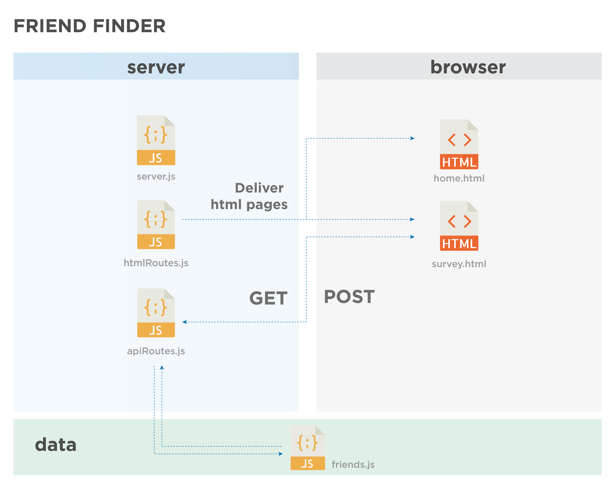

# friendF# Friend finder

App Link: [Friend Finder App](https://agile-meadow-13537.herokuapp.com/survey)

## Overview

* Own server side API's using Express.js framework
* Routing
* HTTP Post requests
* Expres.static()  *This is useful to link files such as .css and img*

# Requirements
* Modularity in the architecture of the project:
 * Server connection 
 * Storing friends
 * Render home and survey
 * Routing
* Survey to find other user that best matches with your answers

# Technologies used
* JavaScript
* node.js
* Express.js | *express.static*
* path
* Bootstrap
* HTML
* nodemon
* postman

# Project Architechture


### 1. 
`server.js`
* Serves static files
* Specifies dynamic port number
* Requires de routing files ('htmlRoutes.js', 'apiRoutes.js')

## 2. 
`friends.js`
The information about friends is stored here:

```js
{
    name: "Cosme Fulanito",
    photo: "https://cosmefulanitophoto.jpg",
    scores: [1,2,3,4,5,1,2,3,4,5]
}
```
This info is useful to find your match and also it's updated everytime a user fills the form survey. 

## 3. Public 
This folder contains the files necessary to display the page to the user, it includes `home.html`, 'survey.html'. Also css files `styles.css`  and the images if necessary. 

`survey.html` sends the answers from the user to /api/friends, which is then handled by 'apiRoutes'. In this file is where the best match is calculated, the user is pushed to `data.js` and then sends the answer to `survey.html` to display the info of the match found. 

## 4. Routing
Handles the info for GET and POST between the files. 
As said before, `apiRoutes`. is where the best match is calculated, the user is pushed to `data.js` and then sends the answer to `survey.html` to display the info of the match found in a toggle. 

## Helpful and simple visualization
This seems kinda complicated but it'll make sense (I guess...)



