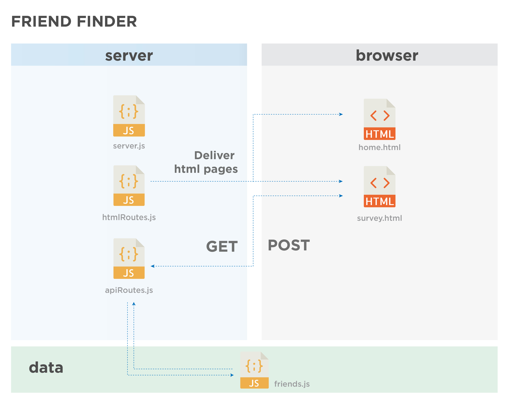
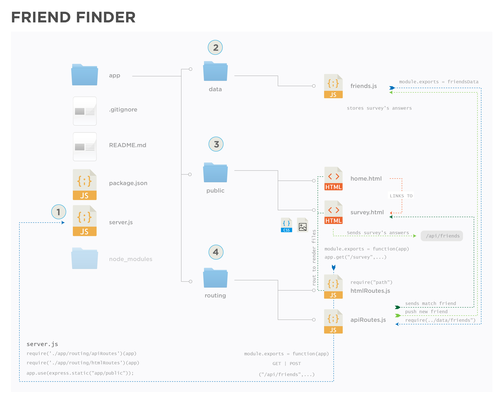

# Friend finder

## App Link
[Friend Finder App](https://agile-meadow-13537.herokuapp.com/survey)

## Overview

* Own server side API's using Express.js framework
* Routing
* HTTP Post requests
* Expres.static()  *This is useful to link files such as .css and img*

#Requirements
* Modularity in the architecture of the project:
 * Server connection 
 * Storing friends
 * Render home and survey
 * Routing
* Survey to find other user that best matches with your answers

#Technologies used
* JavaScript
* node.js
* Express.js | *express.static*
* path
* Bootstrap
* HTML
* nodemon
* postman

#Project Architechture

###1. 'server.js'
* Serves static files
* Specifies dynamic port number
* Requires de routing files ('htmlRoutes.js', 'apiRoutes.js')

##2. 'friends.js'
The information about friends is stored here:

'''js
{
    name: "Cosme Fulanito",
    photo: "https://cosmefulanitophoto.jpg",
    scores: [1,2,3,4,5,1,2,3,4,5]
}
'''
This info is useful to find your match and also it's updated everytime a user fills the form survey. 

##3. Public 
This folder contains the files necessary to display the page to the user, it includes 'home.html', 'survey.html'. Also css files ('styles.css')  and the images if necessary. 

'survey.html' sends the answers from the user to /api/friends, which is then handled by 'apiRoutes'. In this file is where the best match is calculated, the user is pushed to 'data.js' and then sends the answer to 'survey.html' to display the info of the match found. 

##4. Routing
Handles the info for GET and POST between the files. 
As said before, 'apiRoutes'. is where the best match is calculated, the user is pushed to 'data.js' and then sends the answer to 'survey.html' to display the info of the match found in a toggle. 

##Helpful visualization
This seems kinda complicated but it'll make sense (I guess...)

##Another helpful diagram

